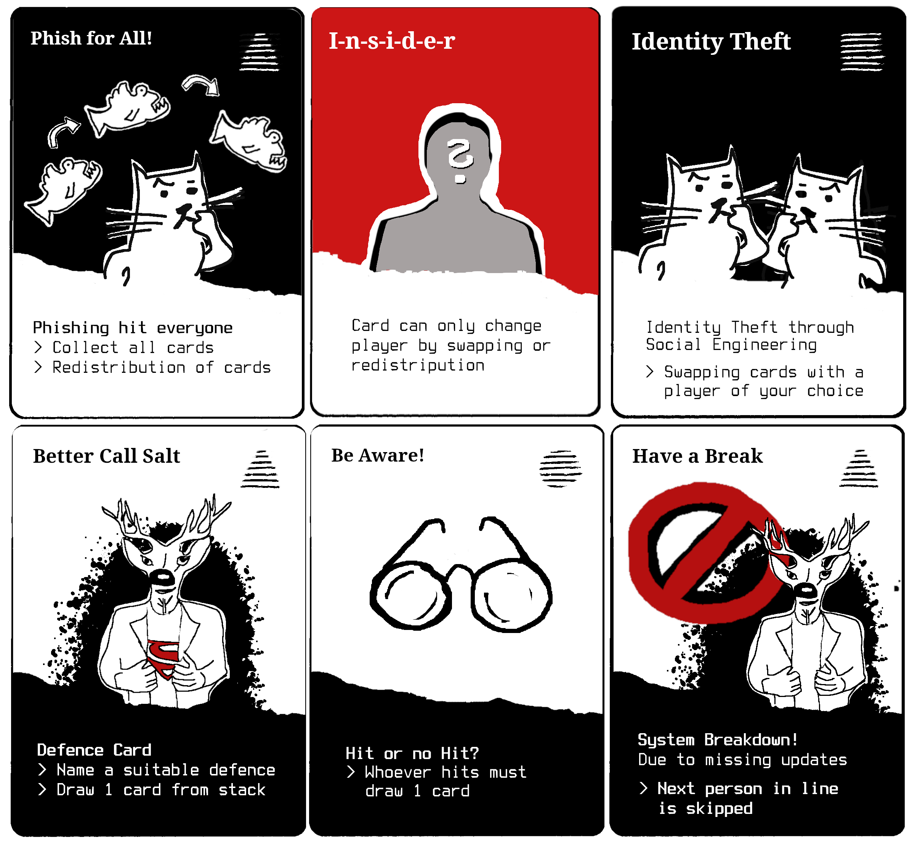

# Salt&Pepper - Security Behavior Card Game

The card game aims to bring about an improvement in human information security behavior.

Salt\&Pepper is a shedding-type card game, i.e. the players start with a hand of
cards and the objective of the game is to be the first player to discard all cards
from one's hand.

<table align="center"><tr><td align="center" width="9999">
</img>
</td></tr></table>

## Getting started
* [Game Instructions](Instructions)
* [Salt&Pepper_CharacterSheet](CharacterSheet)
* [Printing_Template](PrintingTemplate)

## License

 This work is licensed under a <a rel="license" href="http://creativecommons.org/licenses/by-nc-sa/4.0/">Creative Commons Attribution-NonCommercial-ShareAlike 4.0 International License</a>.
